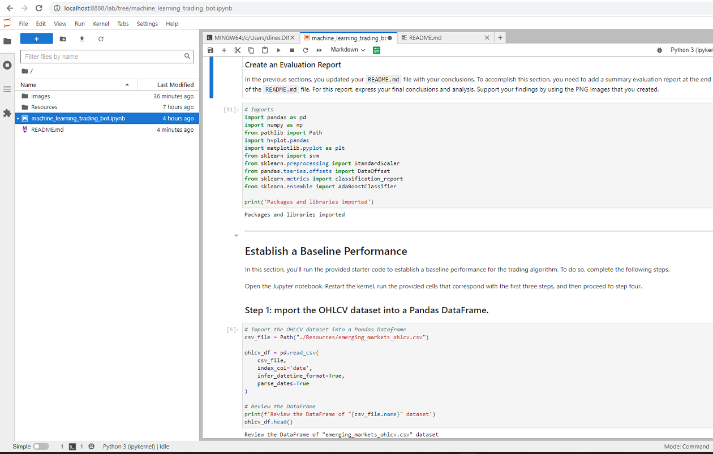
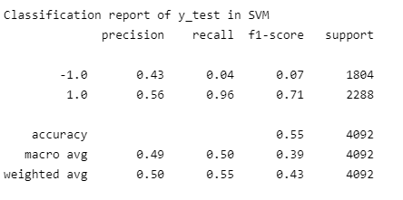
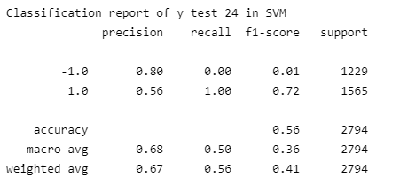
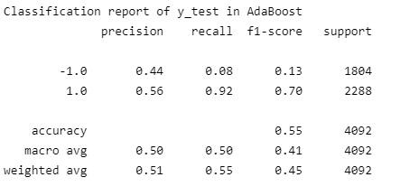
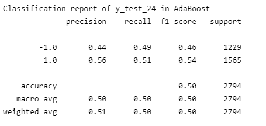

# Machine Learning Bot
Machine Learning Bot is a Jupyter Notebook based application prototype to perform algorithmic trading using a Machine Learning algorithm. The implementation is based on technical analysis of the company's stock price actions.

### **Program Overview**
Assume you are a financial advisor at one of the top five financial advisory firms in the world. Your firm constantly competes with the other major firms to manage and automatically trade assets in a highly dynamic environment. In recent years, your firm has heavily profited by using computer algorithms that can buy and sell faster than human traders.

The speed of these transactions gave your firm a competitive advantage early on. But, people still need to specifically program these systems, which limits their ability to adapt to new data. You’re thus planning to improve the existing algorithmic trading systems and maintain the firm’s competitive advantage in the market. To do so, you’ll enhance the existing trading signals with machine learning algorithms that can adapt to new data.

The program has following key functions:
* Implement an algorithmic trading strategy that uses machine learning to automate the trade decisions.
* Adjust the input parameters to optimize the trading algorithm.
* Train a new machine learning model and compare its performance to that of a baseline model.

---

## Technologies

This project leverages python 3.7.* with the following additional packages:
* [Jupyter Notebook](https://jupyter.org/) - The Machine Learning Bot is written in the Jupyter Notebook.
* [Conda](https://docs.conda.io/projects/conda/en/latest/) - Conda environment is recommended to have Pandas library and other dependencies pre-installed.

**Required Libraries:**

You may need the following libraries to work with the program.

- [Pandas](https://pandas.pydata.org/docs/reference/index.html) - pandas is a Python package providing fast, flexible, and expressive data structures designed to make working with “relational” or “labeled” data both easy and intuitive.
- [hvPlot](https://hvplot.holoviz.org/) - hvPlot provides a high-level plotting API built on HoloViews that provides a general and consistent API for plotting data in Python.
- [scikit-learn](https://scikit-learn.org/stable/getting_started.html/) - Scikit-learn is an open source machine learning library that supports supervised and unsupervised learning.
---

## Usage

To use the Machine Learning Bot, clone the repository and run the **machine_learning_trading_bot.ipynb** with Jupyter notebook.

From the Git Bash terminal, make sure to 'activate conda' and appropriate virtual enivorment. Next, launch the JupyterLab web-based interactive development environment (IDE) interface by typing at the prompt:

```python
  > jupyter lab
```

Then, browse to **machine_learning_trading_bot.ipynb** starter code file to run the program. See the image below for a quick hint.



## Evaluation Report

The Machine Learning Bot's performance is evaluated using [Support Vector Machine Classifier](https://scikit-learn.org/stable/modules/svm.html) [and AdaBoost Classifier](https://scikit-learn.org/stable/modules/generated/sklearn.ensemble.AdaBoostClassifier.html) algorithms. The trading algoriths are trained and tested wit 3 months and 24 months of training window data. Classification Reports and hvPlots may be used as reference for models' performance and recommendation.

**Classification Report: SVM Model Results (3 vs 24 months training window offset data)**
|SVM - 3 months|   |SVM - 24 months|
|:-:|:-:|:-:|
| |||

**Classification Report: AdaBoost Model Results (3 vs 24 months training window offset data)**
|AdaBoost - 3 months|   |AdaBoost - 24 months|
|:-:|:-:|:-:|
| |||

**hvPlot Comparison of SVM vs AdaBoost Classifiers**
|SVM - 3 months|   |AdaBoost - 3 months|
|:-:|:-:|:-:|
| |||

---

|SVM - 24 months|   |AdaBoost - 24 months|
|:-:|:-:|:-:|
| |||

---

**Performance Summary**
* Referring to classification reports of SVM models (3 vs 24 months training window offset data), the modified model with offset training data with 24 months training window has higher accuracy score (56%) than that of the model (55%) with 3 months offset training window data.
* While referring to classification reports of AdaBoostClassifier models (3 vs 24 months training window offset data), the modified model with offset training data with 24 months training window show least accuracy score(50%) among all four models.
* The SVM model with 24 months training offset data shows the highest 'recall' score of '1.00' towards '1' (comparing across all four models), which means 'buy' signal is better favored.
* Overall, SVM model with 24 months training offset data looks better among all seeing Actual Returns and Strategy Returns. However, just a smaller positive price action of the stock price also has to be noted here as compared to others. Hence, small investment can only be suggested to risk-averse investors.

---

## Contributors

FinTech Labs, Inc.

---

## License

None